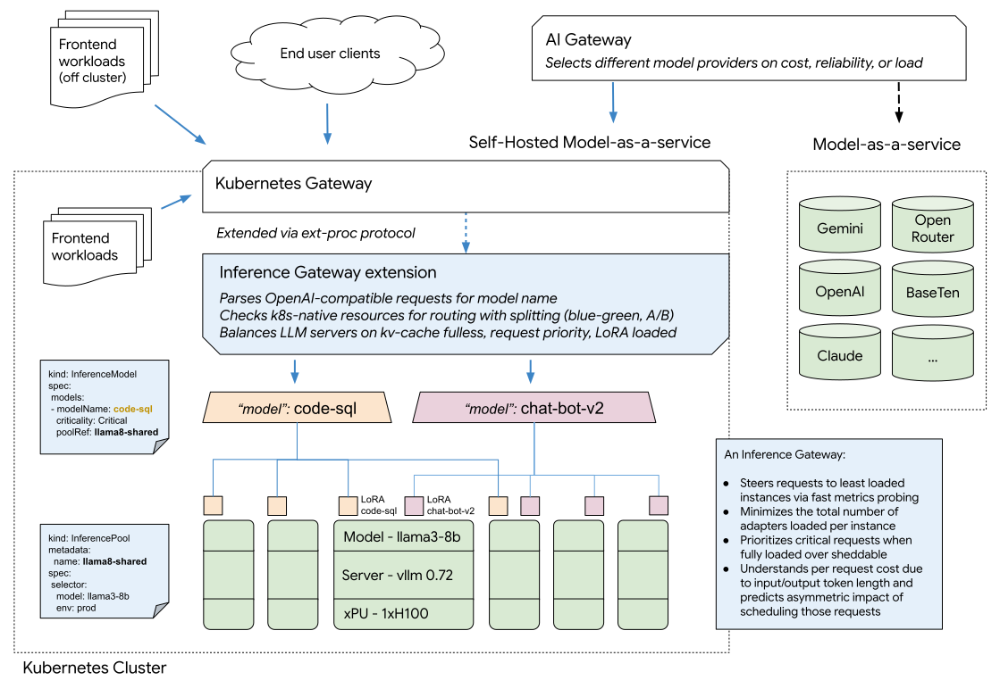

# Gateway API Inference Extension

Gateway API Inference Extension optimizes self-hosting Generative Models on Kubernetes.
This is achieved by leveraging Envoy's [External Processing] (ext-proc) to extend any gateway that supports both ext-proc and [Gateway API] into an **[inference gateway]**. 

[Inference Gateway]:#concepts-and-definitions

## New!
Inference Gateway has partnered with vLLM to accelerate LLM serving optimizations with [llm-d](https://llm-d.ai/blog/llm-d-announce)!

## Concepts and Definitions

The following specific terms to this project:

- **Inference Gateway (IGW)**: A proxy/load-balancer which has been coupled with an
  `Endpoint Picker`. It provides optimized routing and load balancing for
  serving Kubernetes self-hosted generative Artificial Intelligence (AI)
  workloads. It simplifies the deployment, management, and observability of AI
  inference workloads.
- **Inference Scheduler**: An extendable component that makes decisions about which endpoint is optimal (best cost /
  best performance) for an inference request based on `Metrics and Capabilities`
  from [Model Serving](/docs/proposals/003-model-server-protocol/README.md).
- **Metrics and Capabilities**: Data provided by model serving platforms about
  performance, availability and capabilities to optimize routing. Includes
  things like [Prefix Cache] status or [LoRA Adapters] availability.
- **Endpoint Picker(EPP)**: An implementation of an `Inference Scheduler` with additional Routing, Flow, and Request Control layers to allow for sophisticated routing strategies. Additional info on the architecture of the EPP [here](https://github.com/kubernetes-sigs/gateway-api-inference-extension/tree/main/docs/proposals/0683-epp-architecture-proposal).
- **Body Based Router(BBR)**: An optional additional [ext-proc](https://www.envoyproxy.io/docs/envoy/latest/configuration/http/http_filters/ext_proc_filter) server that parses the http body of the inference prompt message and extracts information (currently the model name for OpenAI API style messages) into a format which can then be used by the gateway for routing purposes. Additional info [here](https://github.com/kubernetes-sigs/gateway-api-inference-extension/tree/main/pkg/bbr/README.md) and in the documentation [user guides](https://gateway-api-inference-extension.sigs.k8s.io/guides/). 
 

The following are key industry terms that are important to understand for
this project:

- **Model**: A generative AI model that has learned patterns from data and is
  used for inference. Models vary in size and architecture, from smaller
  domain-specific models to massive multi-billion parameter neural networks that
  are optimized for diverse language tasks.
- **Inference**: The process of running a generative AI model, such as a large
  language model, diffusion model etc, to generate text, embeddings, or other
  outputs from input data.
- **Model server**: A service (in our case, containerized) responsible for
  receiving inference requests and returning predictions from a model.
- **Accelerator**: specialized hardware, such as Graphics Processing Units
  (GPUs) that can be attached to Kubernetes nodes to speed up computations,
  particularly for training and inference tasks.

For deeper insights and more advanced concepts, refer to our [proposals](/docs/proposals).

[Inference]:https://www.digitalocean.com/community/tutorials/llm-inference-optimization
[Gateway API]:https://github.com/kubernetes-sigs/gateway-api
[Prefix Cache]:https://docs.vllm.ai/en/stable/design/v1/prefix_caching.html
[LoRA Adapters]:https://docs.vllm.ai/en/stable/features/lora.html
[External Processing]:https://www.envoyproxy.io/docs/envoy/latest/configuration/http/http_filters/ext_proc_filter

## Technical Overview

This extension upgrades an [ext-proc](https://www.envoyproxy.io/docs/envoy/latest/configuration/http/http_filters/ext_proc_filter) capable proxy or gateway - such as Envoy Gateway, kgateway, or the GKE Gateway - to become an **[inference gateway]** - supporting inference platform teams self-hosting Generative Models (with a current focus on large language models) on Kubernetes. This integration makes it easy to expose and control access to your local [OpenAI-compatible chat completion endpoints](https://platform.openai.com/docs/api-reference/chat) to other workloads on or off cluster, or to integrate your self-hosted models alongside model-as-a-service providers in a higher level **AI Gateway** like LiteLLM, Solo AI Gateway, or Apigee.

The Inference Gateway:

* Improves the tail latency and throughput of LLM completion requests against Kubernetes-hosted model servers using an extensible request scheduling alogrithm that is kv-cache and request cost aware, avoiding evictions or queueing as load increases
* Provides [Kubernetes-native declarative APIs](https://gateway-api-inference-extension.sigs.k8s.io/concepts/api-overview/) to route client model names to use-case specific LoRA adapters and control incremental rollout of new adapter versions, A/B traffic splitting, and safe blue-green base model and model server upgrades
* Adds end to end observability around service objective attainment
* Ensures operational guardrails between different client model names, allowing a platform team to safely serve many different GenAI workloads on the same pool of shared foundation model servers for higher utilization and fewer required accelerators

### Model Server Integration

IGW’s pluggable architecture was leveraged to enable the [llm-d Inference Scheduler](https://github.com/llm-d/llm-d-inference-scheduler).  

Llm-d customizes vLLM & IGW to create a disaggregated serving solution. We've worked closely with this team to enable this integration. IGW will continue to work closely with llm-d to generalize the disaggregated serving plugin(s), & set a standard for disaggregated serving to be used across any [protocol-adherent](https://github.com/kubernetes-sigs/gateway-api-inference-extension/tree/main/docs/proposals/003-model-server-protocol) model server. 

IGW has enhanced support for vLLM via llm-d, and broad support for any model servers implementing the protocol. More details can be found in [model server integration](https://gateway-api-inference-extension.sigs.k8s.io/implementations/model-servers/).

## Status

This project is in alpha. latest release can be found [here](https://github.com/kubernetes-sigs/gateway-api-inference-extension/releases/latest).  
It should not be used in production yet.

## Getting Started

Follow our [Getting Started Guide](https://gateway-api-inference-extension.sigs.k8s.io/guides/) to get the inference-extension up and running on your cluster!

See [our website](https://gateway-api-inference-extension.sigs.k8s.io/) for detailed API documentation on leveraging our Kubernetes-native declarative APIs

## Roadmap

As Inference Gateway builds towards a GA release. We will continue to expand our capabilities, namely:

1. Prefix-cache aware load balancing with interfaces for remote caches
1. Recommended LoRA adapter pipeline for automated rollout
1. Fairness and priority between workloads within the same criticality band
1. HPA support for autoscaling on aggregate metrics derived from the load balancer
1. Support for large multi-modal inputs and outputs
1. Support for other GenAI model types (diffusion and other non-completion protocols)
1. Heterogeneous accelerators - serve workloads on multiple types of accelerator using latency and request cost-aware load balancing
1. Disaggregated serving support with independently scaling pools

## End-to-End Tests

Follow this [README](./test/e2e/epp/README.md) to learn more about running the inference-extension end-to-end test suite on your cluster.

## Contributing

Our community meeting is weekly at Thursday 10AM PDT ([Zoom](https://zoom.us/j/96271651417?pwd=NViXawg6lMsRjgXbu2YmW8DxWqbjta.1), [Meeting Notes](https://www.google.com/url?q=https://docs.google.com/document/d/1frfPE5L1sI3737rdQV04IcDGeOcGJj2ItjMg6z2SRH0/edit?usp%3Dsharing&sa=D&source=calendar&usd=2&usg=AOvVaw1pUVy7UN_2PMj8qJJcFm1U)).

We currently utilize the [#gateway-api-inference-extension](https://kubernetes.slack.com/?redir=%2Fmessages%2Fgateway-api-inference-extension) channel in Kubernetes Slack workspace for communications.

Contributions are readily welcomed, follow the [dev guide](./docs/dev.md) to start contributing!

### Code of conduct

Participation in the Kubernetes community is governed by the [Kubernetes Code of Conduct](code-of-conduct.md).
