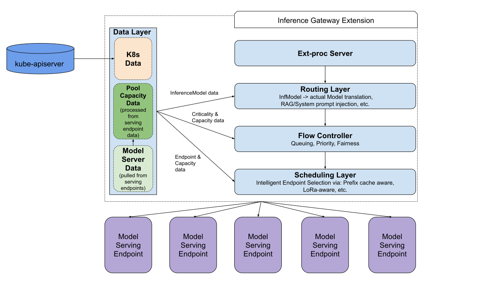

# Gateway API Inference Extension

Author(s): @kfswain
## Proposal Status
 ***Draft***

## Table of Contents

<!-- toc -->

-   [Summary](#summary)
-   [Goals](#goals)
-   [Non-Goals](#non-goals)
-   [Proposal](#proposal)
    -   [Personas](#personas)
        -   [Inference Platform Admin](#inference-platform-admin)
        -   [Inference Workload Owner](#workload-owner)
    -   [Axioms](#axioms)
    -   [InferencePool](#inferencepool)
    -   [InferenceModel](#inferencemodel)
    -   [Spec](#spec)
    -   [Diagrams](#diagrams)
    -   [Alternatives](#alternatives) 
- [Open Questions](#open-questions)
    
<!-- /toc -->

## Summary

This proposal seeks to standardize the implementation of an EPP (End-point Picker) for the Inference Gateway extension (also known as Gateway API Inference Extension). Additionally, this proposes to restructure the current implementation of the EPP to be more modular, and approachable.

## Goals

- Set a standard on how the EPP & APIs interact
- Settle on common nomenclature for clearer communication
- Allow for modularization of the EPP, to be extended to a user's specific needs

## Non-Goals

- Reshaping the current API
- A change in scope of the current project

## Proposal

This proposal is not proposing any net new features, instead, we are refactoring our current implementation to better handle more devs, more features, etc. At the time of writing, GIE is currently at v0.3, and that stronger experimental context (along with external feedback) made clear the need this restructure. The image below give a high level view of how our components work together.

## Overview
At a quick glance, the EPP is being broken into specific layers. The `Data Layer` is of note, as it is a vertical that will be accessed by all the others. The data layer manages the k8s, data, metric & usage data, as well as processing of the above data to determine resource scarcity regimes.

The other layers are handled in sequential process. Starting with the **Ext-Proc** call. The request is buffered and then sent to the **Routing Layer**, which processes any User defined per-InferenceModel routing rules & request enrichment happening first (at the time of writing that is currently just translating the InferenceModel name to a weight-split actual model). Then _all_ requests pass through the to-be-implemented [**Flow Controller**](https://github.com/kubernetes-sigs/gateway-api-inference-extension/issues/674) to ensure that any request entry to the pool adhereing to the guidelines set by the Priority, Fairness, & Queueing configuration. And finally, the **Scheduling Layer** is the load balancing algorithm that intelligently routes requests based on the current state of the InferencePool.

## Components

To further expand upon these component layers. We will first break them into `extensible` and `non-extensible` layers. `Non-extensible` layers are intended to be static, and handled on behalf of the user, typically implementing low-opinion infrastructure. 

The `Extensible` layers are:
- Data Layer
- Routing Layer
- Flow Controller
- Scheduling Layer

The `Non-Extensible` layer(s) are:
- The Ext-Proc Server

### `Extensible`

#### Data Layer

The data layer will consume and store: the InferencePool/InferenceModel config and the pre-defined [Model Server Protocol](../003-model-server-protocol/README.md). Additionally, the data fed from the model servers will be processed and digested to provide resource scarcity regime hints, and autoscaling reccomendations.

Many extensions to scheduling will require changes to ingested metrics, as such, the data layer will be built to be extended, but extenders accept that the Model Server Protocol will no longer provide guarantees on portability of a model server out of the box. 

#### Routing Layer

The routing layer is likely to be the most opinion heavy section, as the scope of what constitutes a 'Route Rule' is somewhat broad. The current examples we expect would be:

- System Prompt injection
- RAG callout
- Per-InferenceModel request validation (such as saftey/on-topic, etc)

Due to the possibility of this becoming a bit of a dumping ground. The API will keep a _very_ tight scope on which of these route rules are included in the spec. A standard method of extension will be provided if the need to define a custom rule arises.

#### Flow Controller (WIP - implementation tracked in [#674](https://github.com/kubernetes-sigs/gateway-api-inference-extension/issues/674))

The flow controller will consume resource regime data, and enforce proper resource sharing between workloads. This will primarily be done through a queuing mechanism [as described here](https://docs.google.com/document/d/1VZL7opFWuwgWquvgiOzLlXAJ633qZ9U-A0ZixGjBgaI/edit?usp=sharing).

#### Scheduling Layer

As the Scheduling Layer is the final interface to the entirety of the pool, all configuration will be at the _pool_ level. The default scheduling layer will be an experimentally-backed LB algorithm, with exposed config values.

The Scheduler will define a strong interface API, so that new scheduling algos may be plugged & dark-launched to test in production traffic without impacting said traffic. Extension is expected to adhere to the [Scheduler Subsystem definition](https://github.com/kubernetes-sigs/gateway-api-inference-extension/pull/603)

### `Non-extensible`

#### Ext-Proc Server

The Ext-Proc Server protocol is very well defined & specific, deviation could cause the EPP to become unusable or unstable. Extension is ill-advised.
