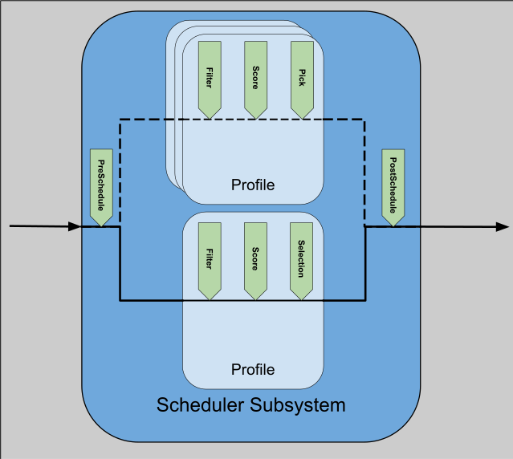

# Scheduling Subsystem Architecture

Author(s): @kfswain, @ahg-g, @nirrozenbaum
## Proposal Status
 ***Draft***

## Summary
The Scheduling Subsystem is a framework used to implement scheduling algorithms. High level definition [here](https://github.com/kubernetes-sigs/gateway-api-inference-extension/tree/main/docs/proposals/006-scheduler) & EPP Architecture [here](https://github.com/kubernetes-sigs/gateway-api-inference-extension/tree/main/docs/proposals/0683-epp-architecture-proposal).

## Design Principles
- The scheduler framework should act as an independent library, there should be no dependency on EPP packages defined outside of the scheduler
- The *framework* should be agnostic to web protocols(such as HTTP), endpoint types (such as model servers), and K8s concepts. 
  - Opinions should be held by the plugins, not the framework
- The entry & exit points should be defined by the framework, acting as the API surface of the system
- Multiple scheduling 'profiles' should be able to be ran for a single request.
    - They can be conditionally dependent on previous runs, or in parallel
- Plugin state is managed by the plugin itself

## Definitions
- **Scheduling Framework** - The system created to allow for a pluggable scheduling algorithm.
- **Scheduling Profile** - A named, specific set of Filter(s), Scorer(s), & Picker used to select endpoints.
- **Scheduler** - An extensible implementation of a scheduling algorithm. Including logic to select Scheduling Profiles, the Scheduling Profiles themselves, & logic to interpret the result.
- **Scheduling Cycle** - A single run of a Scheduler through the Scheduling Framework.
- **Plugin** - Implementation of framework-defined interface(s) to add or extend logic across the framework.

## Proposal

The Scheduling System draws inspiration from the kube-schedulers pluggable system, though there are distinct differences in goals/usage. 

The Scheduling System can loosely be defined into 3 sections:
- A *framework* to implement the system
- The *interfaces* that a consumer can use to extend the system
- A *configuration API* to define the Scheduler, Profile(s), & the plugins used within those profiles

A sketch of the System, with extension points is here:

Describing the interface extension points & flow is the simplest way to convey the intent of what the framework should enable:

### PreSchedule

PreSchedule is the entry point into the scheduling cycle (called by the framework). PreSchedule, selects profiles conditionally based on: 

- Request data
- Results
- Cycle State

PreSchedule will be continuously called so long as profiles are returned; multiple profiles may be returned in a single call. Only a single PreSchedule function may be defined per scheduler.

### Profile Cycle

The profile cycle consists of 3 defined functions `Filter`, `Score`, & `Pick`

*Profile Constraints*
- A profile can have any number of `Filter` plugins registered (including zero)
- A profile can have any number of `Score` plugins registered (including zero)
- A profile MUST have exactly one `Pick` plugin registered

#### Filter
Filter runs before any scoring, and remove endpoints that are not fit for selection. The framework will return an error to the client if the endpoints are filtered to zero.

#### Score
Score applies a score to each remaining endpoint provided. Scorers SHOULD keep their score values in a normalized range: [0-1]. Any weighting should be added at the SchedulingProfile configuration level.

#### Pick
Picker selects the endpoint(s) from the provided list of scored endpoints. Picker MUST return, one endpoint at minimum.

### PostSchedule
PostSchedule recieves the output of the result(s) of the scheduling cycle(s) and makes sense of the data to be consumed by the calling system.

### PostResponse
PostResponse is a special case extension that can optionally be implemented by a plugin that needs to augment its state based on response or request data. This should only be implemented for plugins that need to update state outside of the scheduling cycle. PostResponse is ran at the time of processing a response.

## ConfigurationAPI
TODO