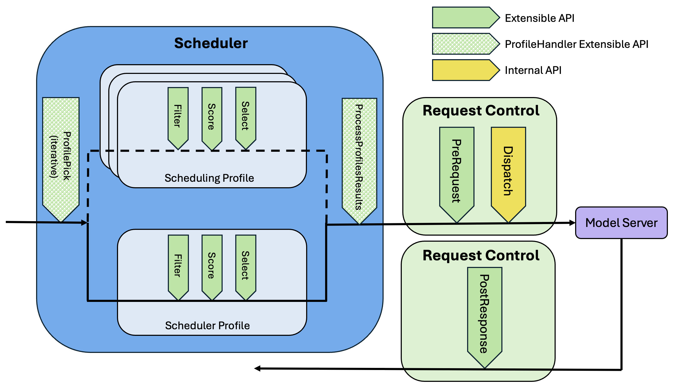

# Scheduling Subsystem Architecture

Author(s): @kfswain, @ahg-g, @nirrozenbaum
## Proposal Status
 ***Implemented***

## Summary
The Scheduling Subsystem is a framework used to implement scheduling algorithms. High level definition [here](https://github.com/kubernetes-sigs/gateway-api-inference-extension/tree/main/docs/proposals/006-scheduler) & EPP Architecture [here](https://github.com/kubernetes-sigs/gateway-api-inference-extension/tree/main/docs/proposals/0683-epp-architecture-proposal).

## Design Principles
- The scheduler framework should act as an independent library, there should be no dependency on EPP packages defined outside of the scheduler
- The *framework* should be agnostic to endpoint types (such as model servers), and K8s concepts. 
  - Opinions should be held by the plugins, not the framework
- The entry & exit points should be defined by the framework, acting as the API surface of the system
- Multiple scheduling 'profiles' should be able to be ran for a single request.
    - They can be conditionally dependent on previous runs, or in parallel
- State management
  - State per request: This is managed by what we are calling CycleState and its lifecycle is tied to the request.
    Cycle state is created internally by the Scheduler per request and its pointer is passed as argument.
  - State managed by the plugin struct itself: The lifecycle of this state is tied to the plugin, and since plugins will be instantiated once, 
    it is a state that plugins can use across requests (like prefix-cache index).
  - State managed by the data layer: each endpoint will be associated with state (currently metrics) that a data layer plugin can add to it. 
    A data layer plugin could be one that scrapes v1/models from the endpoint for example.

## Definitions
- **Scheduling Framework** - The system created to allow for a pluggable scheduling algorithm.
- **Scheduler Profile** - A named, specific set of Filter(s), Scorer(s), & Picker used to select endpoints.
- **Scheduler Profile Run** - a one time run of the Scheduler Profile filters, scorers and picker given a request.
- **Scheduler** - An extensible implementation of a scheduling algorithm. Including logic to select Scheduler Profiles iteratively, 
  the Scheduler Profiles themselves, & logic to interpret the result.
- **Scheduling Cycle** - A single run of a Scheduler through the Scheduling Framework. a scheduling cycle includes one or 
  more Scheduler Profile runs (at least one).
- **Plugin** - Implementation of framework-defined interface(s) to add or extend logic across the framework.

## Proposal

The Scheduling System draws inspiration from the kube-schedulers pluggable system, though there are distinct differences in goals/usage. 

The Scheduling System can loosely be defined into 3 sections:
- A *framework* to implement the system
- The *interfaces* that a consumer can use to extend the system
- A *configuration API* to define the Scheduler, Profile(s), & the plugins used within those profiles

A sketch of the System, with extension points is here:

Describing the interface extension points & flow is the simplest way to convey the intent of what the framework should enable:

### ProfileHandler

ProfileHandler is a schedler plugin with two extension points - ProfilePick, and ProcessProfilesResults.
Below is a detailed explanation about these extension points.
Only a single ProfileHandler plugin may be defined per scheduler.

### ProfilePick

ProfilePick is the entry point into the scheduling cycle (called by the framework). 
it selects profiles conditionally based on: 

- Request data
- Results of previously executed SchedulerProfiles
- Cycle State

ProfilePick will be continuously called so long as profiles are returned; multiple profiles may be returned in a single call.
ProfilePick extension point will be configured as part of a ProfileHandler plugin. 
Since there is only a single ProfileHandler plugin, that means there is only a single ProfilePick function.

### Scheduler Profile Run

The SchedulerProfile run consists of 3 defined phases `Filter`, `Score`, & `Pick`

*Profile Constraints*
- A profile can have any number of `Filter` plugins registered (including zero)
- A profile can have any number of `Score` plugins registered (including zero)
- A profile MUST have exactly one `Pick` plugin registered

#### Filter
Filter runs before any scoring, and remove endpoints that are not fit for selection. The framework will return an error to the client if the endpoints are filtered to zero.

#### Score
Score applies a score to each remaining endpoint provided. Scorers SHOULD keep their score values in a normalized range: [0-1]. Any weighting should be added at the SchedulerProfile configuration level.

#### Pick
Picker selects the endpoint(s) from the provided list of scored endpoints. Picker MUST return, one endpoint at minimum.

### ProcessProfilesResults
ProcessProfilesResults receives the output of the result(s) of the scheduler profile(s) and makes sense of the data to be consumed by the calling system.
Since there is only a single ProfileHandler plugin, that means there is only a single ProcessProfilesResults function.

## ConfigurationAPI
TODO