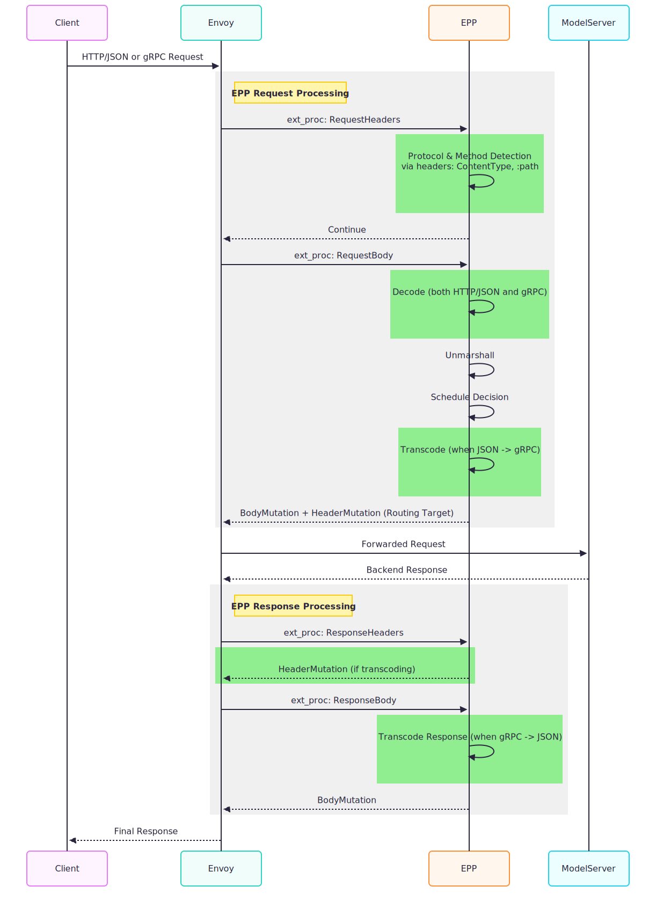

# gRPC support

Author(s): @zetxqx, @ahg-g

For the full, detailed proposal, please see the [original proposal](https://docs.google.com/document/d/1H-WazsrSQOVi8bGgfBLuQ7RTypwa__EncVNu-yRBw1U/edit?tab=t.4i912lhthtwx#heading=h.cvvvoep0ljs9).

## Motivation
Model servers (like vLLM [gRPC](https://github.com/vllm-project/vllm/blob/main/vllm/grpc/vllm_engine.proto) and SGLang [gRPC](https://github.com/sgl-project/sglang/blob/main/python/sglang/srt/grpc/sglang_scheduler.proto)) now offer gRPC endpoints. As the gateway layer, Inference gateway extension needs to support gRPC not only for compatibility with those gRPC model server but also for the following benefits:
*   gRPC Protocol Efficiency: It has binary framing, more efficient than text-based JSON, reducing payload size and parsing overhead.
*   Flexibility: Gives us the flexibility to support tokenization at GAIE Level, because all those gRPC endpoints are supporting tokens-in, tokens-out.

## Goal
*   InferencePool API changes to support gRPC
*   EPP changes to support gRPC including:
    *   gRPC-in, gRPC-out
    *   HTTP-in, gRPC-out

## Proposed API Changes
The current InferencePool implementation defaults to HTTP/1.1 communication. To support gRPC, which operates over HTTP/2, a field must be introduced for the gateway controller to identify the appropriate appProtocol for model server communication.

This proposal introduces an `AppProtocol` (similar to k8s [servicePort](https://github.com/kubernetes/api/blob/82d2200b6363cca3aba07c043b95d88704c2ddb3/core/v1/types.go#L6204C1-L6220C92)) field to the `InferencePoolSpec` struct within the `InferencePool`. This field applies to all `TargetPorts`.

```go
// InferencePoolSpec defines the desired state of the InferencePool.
type InferencePoolSpec struct {
    // ... other fields

    // ... omitted
    TargetPorts []Port `json:"targetPorts,omitempty"`

    // AppProtocol describes the application protocol for all the target ports.
    //
    // If unspecified, the protocol defaults to HTTP/1.1.
    //
    // Supported values include:
    // * "http": HTTP/1.1. This is the default.
    // * "kubernetes.io/h2c": HTTP/2 over cleartext.
    //
    // +kubebuilder:validation:Enum=http;"kubernetes.io/h2c"
    // +optional
    AppProtocol AppProtocol `json:"appProtocol,omitempty"`

    // ... omitted
}
```

## EndPointPicker (EPP) Enhancements
The current implementation of the `pkg/epp/handlers/server.go` (ext_proc streaming server) is limited to handling HTTP/JSON payloads. To accommodate gRPC model servers, EPP need to be updated to support two primary traffic patterns:

1.  **gRPC-in-gRPC-out:** Both the client and model server utilize gRPC. In this scenario, EPP primarily needs to decode gRPC protobuf messages.
2.  **http-in-gRPC-out:** The client sends HTTP/JSON requests (OpenAI API), while the model server expects gRPC. This requires EPP to perform the following transcoding tasks:
    1. Transcode incoming HTTP/JSON requests to gRPC.
    2. Transcode gRPC responses back to HTTP/JSON.
    3. For streaming workloads, transcode gRPC response streams into Server-Sent Events (SSE) format.

The diagram below outlines the proposed changes within the ext_proc streaming server sequence diagram (simplified/omitted some components to focus on the key changes), highlighting new logic for protocol detection and transcoding in green:



Specifically, the key components within the EPP codebase necessitating modification are:
*   `pkg/epp/handlers/server.go`: Update the main `Process` loop to detect content type and delegate parsing.
*   `pkg/epp/codec` (New Package): Implement parsers for JSON (existing logic) and gRPC (new logic).

**More implementation details:**
1. The EPP should determine when transcoding is required for http-in, gRPC-out scenarios. This can be achieved through one of the following methods:
    1. Implementing a configuration flag or environment variable within EPP to explicitly signal the need for transcoding.
    2. **(Preferred)** EPP can inspect the observed InferencePool specification. If `InferencePoolSpec.AppProtocol` is designated as `kubernetes.io/h2c`, transcoding should happen.
2. EPP needs to know how to do protocol conversion. This will be mainly based on headers diff between HTTP/JSON and gRPC.
3. A designated folder will be required to maintain copies of the vLLM and SGLang protocol buffers. To ensure production stability, a compatibility matrix will be needed for users, mapping supported GAIE versions to model server proto versions.

## Implementation Plan
There are several dimensions we can parallel the whole work:
*   **Support for different protocol pattern:**
    *   gRPC-in, gRPC-out
    *   HTTP-in, gRPC-out
*   **Support for Key APIs** (listing most critical pathways):
    *   Generate (Non-Streaming) - `/chat/completion`
    *   Generate (Streaming)
    *   GetModelInfo `/v1/models`

The initial plan prioritizes the following:
1.  The initial focus will be on vLLm gRPC. Meanwhile, efforts will continue to establish a separate package for common proto definitions across model servers.
2.  Implement gRPC-in, gRPC-out first, as it presents the simplest path forward. However, rapid support for HTTP-in, gRPC-out is crucial given the majority of users rely on the OpenAI compatible endpoint.
3.  The Generate API must be prioritized among all supported APIs.

### Gateway Implementation Requirements
*   Modify the InferencePool API to incorporate an `appProtocol` field.
*   Introduce conformance tests to validate gRPC support.
*   Await the necessary gateway layer support for specifying the `appProtocol` within InferencePool definitions.

### Phase 1: gRPC-to-gRPC Protocol Support
*   Implement the Generate API in non-streaming mode.
*   Implement the streaming mode for the Generate API.
*   Provide practical examples, including epp and vLLM gRPC manifests, and update the Helm chart as necessary.
*   Conduct performance benchmarking to confirm no degradation compared to the existing HTTP support.

### Phase 2: HTTP-to-gRPC Conversion Support
*   Support non-streaming `/chat/completion`.
*   Support streaming `/chat/completion`.
*   Update examples and the Helm chart accordingly.
*   Perform benchmarking to ensure minimal performance impact relative to existing HTTP support.

### Phase 3: Additional API Support
*   Implement support for GetModelInfo and the `/v1/models` endpoint.
*   Implement support for GetServerInfo (if necessary).
*   Address metrics scraping specifically for gRPC endpoints (if necessary).

### Future Plan
*   Introduce support for SGLang gRPC.
*   Integrate disaggregated tokenization capabilities.
