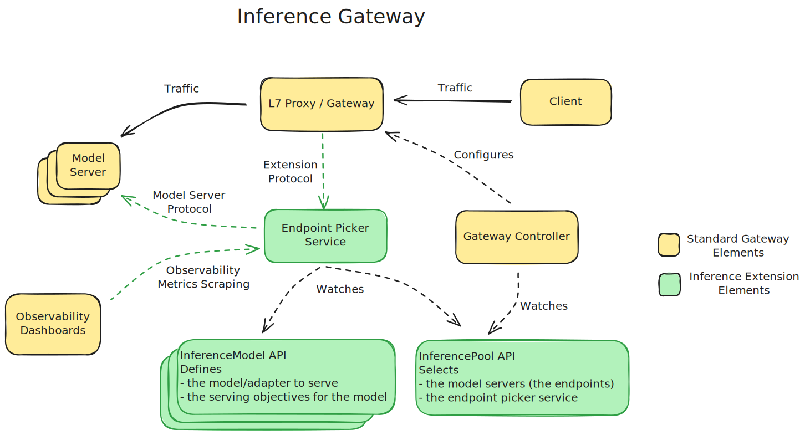

# The EndPoint Picker (EPP)
This package provides the reference implementation for the Endpoint Picker (EPP). As demonstrated in the diagram below, it implements the [extension protocol](../../docs/proposals/004-endpoint-picker-protocol), enabling a proxy or gateway to request endpoint hints from an extension, and interacts with the model servers through the defined [model server protocol](../..//docs/proposals/003-model-server-protocol).

## Core Functions

An EPP instance handles a single `InferencePool` (and so for each `InferencePool`, one must create a dedicated EPP deployment), it performs the following core functions:

- Endpoint Selection
  - The EPP determines the appropriate Pod endpoint for the load balancer (LB) to route requests.
  - It selects from the pool of ready Pods designated by the assigned InferencePool's [Selector](https://github.com/kubernetes-sigs/gateway-api-inference-extension/blob/7e3cd457cdcd01339b65861c8e472cf27e6b6e80/api/v1alpha1/inferencepool_types.go#L53) field.
  - Endpoint selection is contingent on the request's ModelName matching an `InferenceObjective` that references the `InferencePool`.
  - Requests with unmatched ModelName values trigger an error response to the proxy.
- Traffic Splitting and ModelName Rewriting
  - The EPP facilitates controlled rollouts of new adapter versions by implementing traffic splitting between adapters within the same `InferencePool`, as defined by the `InferenceObjective`.
  - EPP rewrites the model name in the request to the [target model name](https://github.com/kubernetes-sigs/gateway-api-inference-extension/blob/7e3cd457cdcd01339b65861c8e472cf27e6b6e80/api/v1alpha1/inferencemodel_types.go#L161) as defined on the `InferenceObjective` object.
- Observability
  - The EPP generates metrics to enhance observability.
  - It reports InferenceObjective-level metrics, further broken down by target model.
  - Detailed information regarding metrics can be found on the [website](https://gateway-api-inference-extension.sigs.k8s.io/guides/metrics/).
  