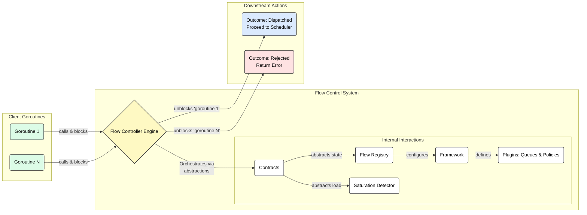

# Flow Control Module

## Introduction

In a multi-tenant, heterogeneous inference serving environment, managing diverse SLOs and fairness requirements is
critical. Today, the serving stack often relies on a simple "best-effort" or FIFO (First-In, First-Out) basis for
handling requests. This is insufficient and leads to significant problems:

* **Head-of-Line Blocking**: A long-running, low-priority request can block short, high-priority requests, violating
  SLOs.
* **Lack of Predictability**: Without proper queuing and prioritization, it's impossible to provide predictable latency
  guarantees to different tenants.
* **Inability to Handle Saturation**: Under heavy load, the system has no graceful way to manage overload, leading to
  cascading failures instead of controlled degradation.

The Flow Controller is a sophisticated library designed to solve these problems. It acts as a crucial gatekeeper that
decides *if* and *when* a request should proceed to be scheduled. Its primary mission is to enable predictable, fair,
and efficient utilization of shared backend resources by enforcing prioritization, applying fairness policies, managing
request queuing under saturation, and orchestrating displacement (the eviction of lower-priority queued items to make
space for higher-priority ones).

It is designed for extensibility, allowing custom logic for policies and queuing mechanisms to be plugged into a robust,
high-performance orchestration engine.

### Role in the Gateway API Inference Extension

Within the Gateway API Inference Extension's Endpoint Picker (EPP), the Flow Controller acts as a crucial gatekeeper
between the Routing and Scheduling layers. It decides *if* and *when* a request, already assigned to a logical flow
(e.g., a specific workload or tenant), should proceed to be scheduled onto a backend resource. It is the primary
mechanism for managing diverse SLOs, ensuring fairness among competing workloads, and maintaining system stability under
high load.

### High Level Architecture

The following diagram illustrates the high-level dependency model and request flow for the system. It shows how
concurrent client requests are managed by the central `FlowController`, which in turn relies on a set of decoupled
components to make its decisions. Each component package in this module will contain its own more detailed architectural
diagrams.

## Architectural Pillars

The Flow Controller framework is built on several key components that work in concert. This architecture is designed to
be highly modular and scalable, with clear separation of concerns. For a deep dive into the specific design choices and
their justifications, please refer to the detailed documentation within the relevant sub-packages.

1.  **The `FlowController` Engine (`./controller`)**: The central, sharded orchestrator responsible for the main request
    processing loop. It manages a pool of workers that distribute incoming requests, apply policies, and dispatch
    requests to the backends. Its design focuses on high throughput and backpressure.

2.  **Pluggable `Policy` Framework (`./framework`)**: This defines the core interfaces for all pluggable logic. It
    features a two-tier policy system for `InterFlow` (decisions *between* different flows) and `IntraFlow`
    (decisions *within* a single flow) logic, covering both request dispatch and displacement.

3.  **Extensible `SafeQueue` System (`./framework`)**: This defines the `framework.SafeQueue` interface for
    concurrent-safe request storage. It uses a `QueueCapability` system that allows for diverse and extensible queue
    implementations (e.g., FIFO, Priority Heap) while maintaining a stable interface.

4.  **The `FlowRegistry` (`./registry`, `./contracts`)**: This is the stateful control plane of the system. It manages
    the configuration and lifecycle of all flows, policies, and queues. It presents a sharded view of its state to the
    `FlowController` workers to enable parallel operation with minimal lock contention.

5.  **Core Types and Service Contracts (`./types`, `./contracts`)**: These packages define the foundational data
    structures (e.g., `FlowControlRequest`), errors, and service interfaces that decouple the engine from its
    dependencies, following a "Ports and Adapters" architectural style.
