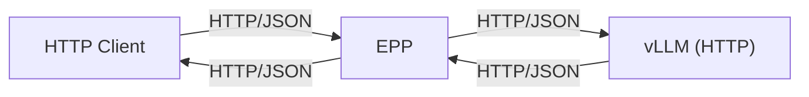
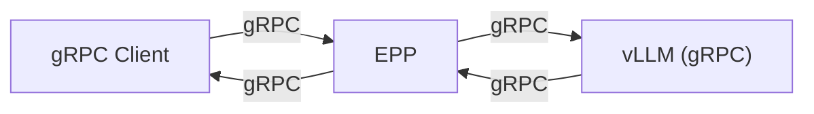
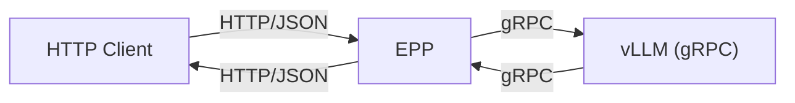

# gRPC Support in EPP (Proof of Concept)

This document outlines the Proof of Concept (PoC) for adding gRPC support to the Endpoint Picker (EPP). All necessary code and manifests are included in this PR.

The implementation, located in `cmd/epp/main.go`, acts as a minimal skeleton of EPP, implementing only the essential External Processor (`ext_proc`) logic. For the purpose of this demonstration, it bypasses the standard scheduling algorithms and replaces dynamic endpoint discovery with static endpoint configuration.

The focus of this PoC is to validate the communication path between the Client/Envoy and EPP, and between EPP and the Model Server. Specifically, it proves that EPP can intercept and parse gRPC requests, which is a fundamental requirement for EPP's scheduling logic. Furthermore, it demonstrates the capability to convert HTTP requests to gRPC and gRPC responses back to HTTP.

## Implementation References
- **EPP Logic**: [`cmd/epp/main.go`](../../../../cmd/epp/main.go) (Implements `envoy.service.ext_proc.v3.ExternalProcessor`)
- **Deployment**: [`standalone.yaml`](standalone.yaml)
- **Client Verification**: [`client/main.go`](client/main.go)

## Scenarios

This PoC realizes three distinct traffic scenarios:

### 1. HTTP -> EPP -> vLLM (HTTP) (Baseline)
This is the existing standalone EPP use case where both the client and the model server communicate via HTTP/JSON.



### 2. gRPC -> EPP -> vLLM (gRPC)
In this scenario, the client sends gRPC requests. EPP parses the gRPC payload to extract necessary information (e.g., token counts) for scheduling/metrics, then forwards the gRPC request to the model server.



### 3. HTTP -> EPP -> vLLM (gRPC) (Protocol Translation)
EPP converts incoming HTTP/JSON requests into gRPC requests for the backend, and converts the gRPC responses back to HTTP/JSON for the client.

**EPP Responsibilities:**
1.  **Request**: Convert HTTP/JSON (e.g., `/v1/chat/completions`) to gRPC Request (e.g., `GenerateRequest`).
2.  **Response**: Convert gRPC Response (e.g., `GenerateResponse`) back to HTTP/JSON.



## Supported APIs

The PoC currently supports the following mappings:

| HTTP API | gRPC API | Description |
| :--- | :--- | :--- |
| `GET /v1/models` | `GetModelInfo` | Retrieve model information. |
| `POST /v1/chat/completions` | `Generate` (non-streaming) | Standard chat completion. |
| `POST /v1/chat/completions` | `Generate` (streaming) | Chat completion with `stream: true`. |

## Setup and Deployment

The PoC uses a custom EPP image and a standalone Kubernetes deployment.

### Prerequisites
- Kubernetes cluster (e.g., GKE, Kind)
- `kubectl` configured
- `go` installed (for running the client)

### Deployment Steps

1.  **Deploy EPP and Model Server**:
    Apply the standalone configuration. This manifest currently contains multiple deployments for different scenarios:
    *   `gaie-inference-scheduling-epp`: Standard gRPC proxying (Scenario 2).
    *   `gaie-inference-scheduling-epp2`: HTTP-to-gRPC conversion enabled (Scenario 3).
    *   `gaie-inference-scheduling-epphttp`: HTTP-to-HTTP (Scenario 1).

    ```bash
    export NS=llmd-standalone
    kubectl create ns $NS || true
    kubectl apply -f pkg/epp/grpc/examples/standalone.yaml -n $NS
    ```

    *Note: The deployments use the image `us-central1-docker.pkg.dev/bobzetian-gke-dev/gateway-api-inference-extension/epp:mygrpc2`.*

2.  **Verify Pods**:
    Ensure `gaie-inference-scheduling-epp` and the model server pods are running.

    ```bash
    kubectl get pods -n $NS
    ```

### Service & Deployment Mapping

The `standalone.yaml` manifest creates multiple resources to support the different testing scenarios simultaneously.

#### Deployments (EPP Proxies)
| Deployment Name | Role | Scenario | Configuration |
| :--- | :--- | :--- | :--- |
| `gaie-inference-scheduling-epp` | **gRPC Proxy** | **Scenario 2** | Proxies gRPC traffic directly to the gRPC model server. <br> Args: `--target-ip <ms-grpc-ip>` |
| `gaie-inference-scheduling-epp2` | **Protocol Translator** | **Scenario 3** | Converts HTTP requests to gRPC, forwards to gRPC model server, and converts responses back. <br> Args: `--enable-http-convert`, `--target-ip <ms-grpc-ip>` |
| `gaie-inference-scheduling-epphttp` | **HTTP Proxy** | **Scenario 1** | Proxies HTTP traffic to the HTTP model server (Baseline). <br> Args: `--target-ip <ms-http-ip>` |

#### Services (Entry Points)
| Service Name | Type | Maps To | Description |
| :--- | :--- | :--- | :--- |
| `gaie-inference-scheduling-epp` | LoadBalancer | `gaie-inference-scheduling-epp` | Use this IP/Port for **Native gRPC Client** testing. |
| `gaie-inference-scheduling-epp2` | LoadBalancer | `gaie-inference-scheduling-epp2` | Use this IP/Port for **HTTP Client (Translation)** testing. |
| `gaie-http` | LoadBalancer | `gaie-inference-scheduling-epphttp` | Use this IP/Port for **HTTP Client (Baseline)** testing. |

#### Model Services (Backends)
| Deployment Name | Container Command | Port | Description |
| :--- | :--- | :--- | :--- |
| `ms-grpc` | `vllm.entrypoints.grpc_server` | `50051` | vLLM running in gRPC mode. Backend for Scenario 2 & 3. |
| `ms-http` | `vllm.entrypoints.openai.api_server` | `8000` | vLLM running in HTTP mode. Backend for Scenario 1. |

### Envoy Configuration
The `standalone.yaml` defines two Envoy configurations to accommodate different scenarios:
*   **`envoy` ConfigMap**: Used by gRPC and Protocol Translation deployments (`gaie-inference-scheduling-epp` and `gaie-inference-scheduling-epp2`). It sets `suppress_envoy_headers: false` (default), allowing Envoy to add standard headers.
*   **`envoyhttp` ConfigMap**: Used by the HTTP Baseline deployment (`gaie-inference-scheduling-epphttp`). It sets `suppress_envoy_headers: true`. This is required to ensure the HTTP model server receives requests without additional Envoy-specific headers, mimicking a direct connection and matching baseline expectations.

## Verification

### 1. gRPC -> gRPC Verification

Use the provided Go client to send native gRPC requests.

1.  **Port Forward** (if testing locally) or get the LoadBalancer IP for the EPP gRPC port.
    
    *Assuming direct access or port-forwarding to port 8081 (HTTP) or specific gRPC port if exposed separately. Based on `standalone.yaml`, EPP listens on 9002 for gRPC internally, but the service `gaie-inference-scheduling-epp` exposes port 8081.*
    
    *Actually, looking at `client/main.go`, the client connects to a target address.*

    ```bash
    # Example: Run the gRPC client
    # Replace TARGET_ADDRESS with the EPP Service IP/Port
    go run ./pkg/epp/grpc/examples/client --target-address "34.169.180.33:8081"
    ```

    The client performs:
    - `GetModelInfo`
    - `Generate` (Streaming)

### 2. HTTP -> gRPC Verification (Protocol Translation)

Use `curl` to send HTTP requests which EPP will translate to gRPC for the backend.

**Environment Setup:**
```bash
export IP=<EPP_SERVICE_IP> # e.g., 34.82.61.76
export MODEL_NAME="Qwen/Qwen3-8B-FP8" # Or "random_model" as per deployment
```

**Chat Completion (Non-Streaming):**
```bash
curl -i http://${IP}:8081/v1/chat/completions \
-H "Content-Type: application/json" \
-d '{
  "model": "'"${MODEL_NAME}"'",
  "messages": [
    {
      "role": "user",
      "content": "Hello, world!"
    }
  ],
  "max_completion_tokens": 10
}'
```

**Get Model Info:**
```bash
curl -i http://${IP}:8081/v1/models
```

**Chat Completion (Streaming):**
```bash
curl -i -N http://${IP}:8081/v1/chat/completions \
  -H "Content-Type: application/json" \
  -d '{
    "model": "'"${MODEL_NAME}"'",
    "messages": [
      {
        "role": "user",
        "content": "Hello, world!"
      }
    ],
    "stream": true,
    "stream_options": {
      "include_usage": true
    }
  }'
```
