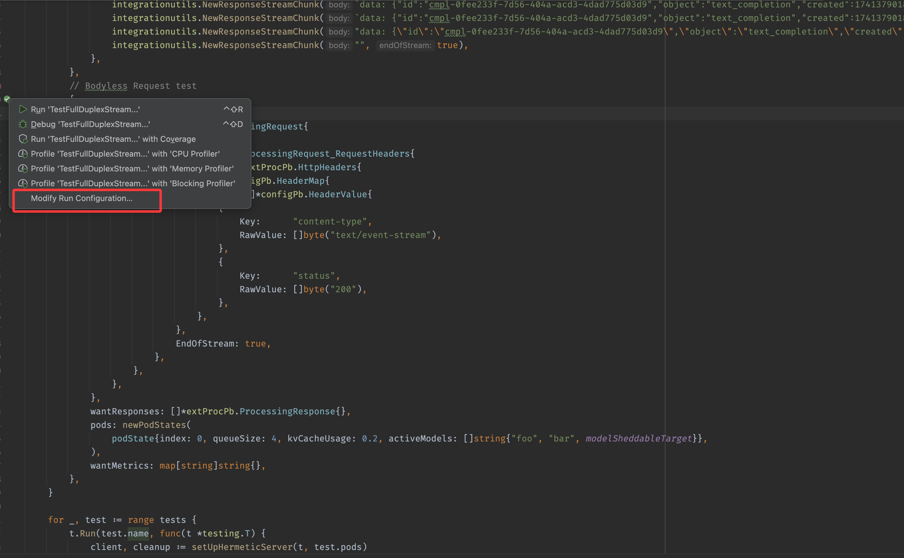
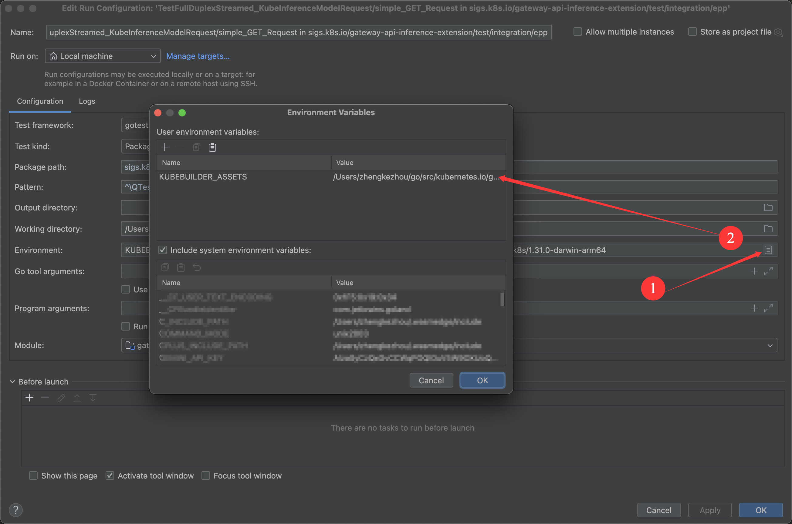
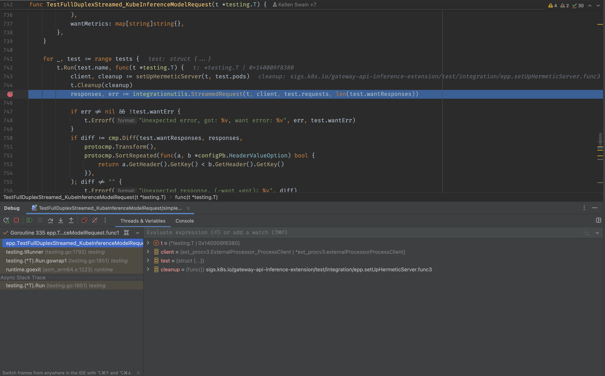

# Developer Guide

## Integration Tests Debug Guide
This document provides detailed instructions on how to run and debug integration tests locally in debug mode.

### Prerequisites

#### 1. Install Required Tools
Ensure the envtest tool is installed:
```bash
$ make envtest
```

#### 2. Verify Kubernetes Test Environment
Run the following command to set up and verify the test environment:
```bash
$ ./bin/setup-envtest use 1.31.0 --bin-dir ./bin -p path
bin/k8s/1.31.0-darwin-arm64
```
### Run test in shell
```shell
export KUBEBUILDER_ASSETS=<project-root-path>/bin/k8s/1.31.0-<platform-architecture> 
go test sigs.k8s.io/gateway-api-inference-extension/test/integration/epp -run <test-function-name>
```

### Configure and Run in GoLand

#### 1. Create Test Configuration
Select the test case you want to debug:


#### 2. Configure Environment Variables
Set environment variables in the Run/Debug Configuration:



**Required environment variable:**

- **Name:** `KUBEBUILDER_ASSETS`
- **Value:** `<project-root-path>/bin/k8s/1.31.0-<platform-architecture>`

**Example path:**
```
/go/src/kubernetes.io/gateway-api-inference-extension/bin/k8s/1.31.0-darwin-arm64
```

#### 3. Set Breakpoints and Run

Example Output:


