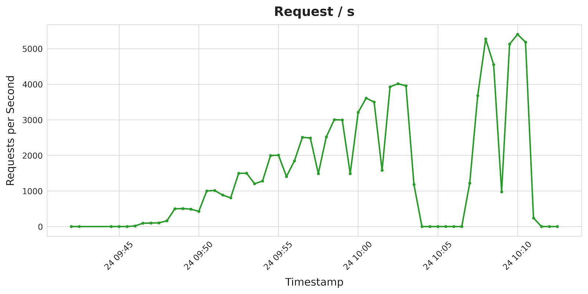
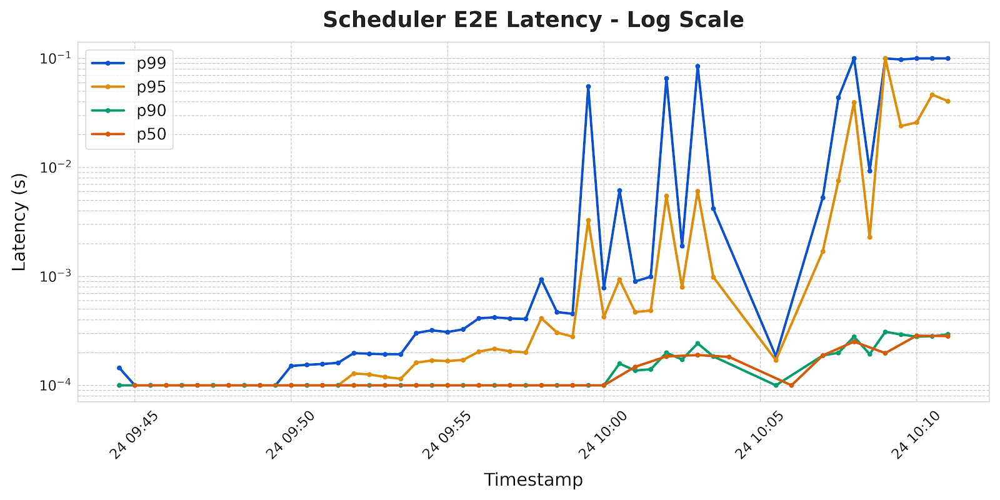

# EPP Resource Tuning

This page documents the default resource requests and limits for the Endpoint Picker (EPP) deployment and guidance on when to adjust them.

## Default Resources

The Helm chart sets the following defaults for the EPP container:

| Setting | Value | Rationale |
| :--- | :--- | :--- |
| CPU request | 4 cores | Sufficient for built-in scheduling plugins under sustained load |
| Memory request | 8 Gi | Baseline working set for EPP with default plugins |
| CPU limit | *unset* | Allows bursting to all available node CPUs during scheduling spikes |
| Memory limit | 16 Gi | Prevents the node from entering memory pressure in case of a memory leak |

The `terminationGracePeriodSeconds` is set to **130 seconds** to match the grace period used in
the vLLM example deployment, ensuring in-flight requests can drain before the pod is killed.

## Validation

These defaults were validated using the [Inference Perf](https://github.com/kubernetes-sigs/inference-perf)
tool with the following setup:

- **Model:** Qwen/Qwen3-32B served by vLLM
- **Load:** Poisson arrival, staged ramp from 1 to 5000 QPS in steps of 500 (100s per stage), 88 workers, max concurrency 100, max TCP connections 2500
- **Data:** Shared-prefix workload — 150 groups, 5 prompts/group, system prompt 60 tokens, question 12 tokens, output 10 tokens
- **API:** Streaming completions

**Result:** p90 scheduler latency remained within **100 ms** across all stages.

To reproduce, see the [Benchmark guide](../../performance/benchmark/index.md) for instructions
on deploying Inference Perf with custom configurations.

## When to Increase Resources

You should consider increasing the resource requests if:

- You add **computationally intensive plugins** (e.g., latency prediction scorers, custom scorers with ML inference).
- You deploy **sidecars** alongside the EPP container that share the pod's resource budget.
- You observe **CPU throttling** or **increased scheduling latency** under your production traffic patterns.
