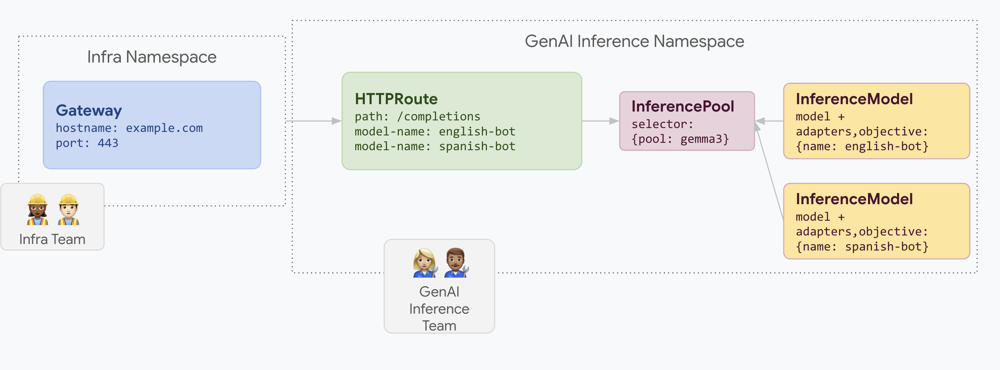

# Serve LoRA adapters on a shared pool
A company wants to serve LLMs for document analysis and focuses on audiences in multiple languages, such as English and Spanish.
They have a fine-tuned LoRA adapter for each language, but need to efficiently use their GPU and TPU capacity.
You can use an Inference Gateway to deploy dynamic LoRA fine-tuned adapters for each language (for example, `english-bot` and `spanish-bot`) on a common base model and accelerator.
This lets you reduce the number of required accelerators by densely packing multiple models in a shared pool.

## How
The following diagram illustrates how Inference Gateway serves multiple LoRA adapters on a shared pool.

This example illustrates how you can densely serve multiple LoRA adapters with distinct workload performance objectives on a common InferencePool.
```yaml
apiVersion: gateway.networking.x-k8s.io/v1alpha1
kind: InferencePool
metadata:
  name: gemma3
spec:
  selector:
    pool: gemma3
```
Let us say we have a couple of LoRA adapters named “english-bot” and “spanish-bot” for the Gemma3 base model.
You can create an `InferenceModel` resource and associate these LoRA adapters to the relevant InferencePool resource.  
In this case, we associate these LoRA adapters to the gemma3 InferencePool resource created above.

```yaml
apiVersion: inference.networking.x-k8s.io/v1alpha2
kind: InferenceModel
metadata:
  name: english-bot
spec:
  criticality: 1
  poolRef:
    name: gemma3
        
---
apiVersion: inference.networking.x-k8s.io/v1alpha2
kind: InferenceModel
metadata:
  name: spanish-bot
spec:
  criticality: 2
  poolRef:
    name: gemma3
    
```
Now, you can route your requests from the gateway using the `HTTPRoute` object.
```yaml
apiVersion: gateway.networking.k8s.io/v1
kind: Gateway
metadata:
  name: inference-gateway
spec:
  listeners:
  - protocol: HTTP
    port: 80
    name: http

---
kind: HTTPRoute
apiVersion: gateway.networking.k8s.io/v1
metadata:
  name: routes-to-llms
spec:
  parentRefs:
    - name: inference-gateway
  rules:
  - matches:
      path:
        type: PathPrefix
        value: /
    backendRefs:
    - name: gemma3
      kind: InferencePool
```

## Try it out

1. Get the gateway IP:
```bash
IP=$(kubectl get gateway/inference-gateway -o jsonpath='{.status.addresses[0].value}'); PORT=80
```
2. Send a few requests to model "english-bot" as follows:
```bash
curl -i ${IP}:${PORT}/v1/completions -H 'Content-Type: application/json' -d '{
"model": "english-bot",
"prompt": "What is the color of the sky",
"max_tokens": 100,
"temperature": 0
}'
```
3. Send a few requests to model "spanish-bot" as follows:
```bash
curl -i ${IP}:${PORT}/v1/completions -H 'Content-Type: application/json' -d '{
"model": "spanish-bot",
"prompt": "¿De qué color es...?",
"max_tokens": 100,
"temperature": 0
}'
```