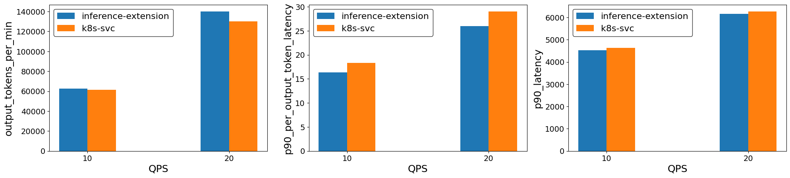

# Benchmark

This user guide shows how to run benchmarks against a vLLM model server deployment by using both Gateway API
Inference Extension, and a Kubernetes service as the load balancing strategy. The benchmark uses the
[Inference Perf](https://github.com/kubernetes-sigs/inference-perf) tool to generate load and collect results.

## Prerequisites

### Deploy the inference extension and sample model server

Follow the [getting started guide](https://gateway-api-inference-extension.sigs.k8s.io/guides/#getting-started-with-gateway-api-inference-extension)
to deploy the vLLM model server, CRDs, etc.

__Note:__ Only the GPU-based model server deployment option is supported for benchmark testing.

### [Optional] Scale the sample vLLM deployment

You are more likely to see the benefits of the inference extension when there are a decent number of replicas to make the optimal routing decision.

```bash
kubectl scale deployment vllm-llama3-8b-instruct --replicas=8
```

### Expose the model server via a k8s service

To establish a baseline, expose the vLLM deployment as a k8s service:

```bash
kubectl expose deployment vllm-llama3-8b-instruct --port=80 --target-port=8000 --type=LoadBalancer
```

## Run benchmark

The inference perf tool works by sending traffic to the specified target IP and port, and collecting the results.
Follow the steps below to run a benchmark against k8s and inference gateway. Multiple benchmarking instances can be deployed to run benchmarks in
parallel against different targets.

#### Parameters to customize:

For more parameter customizations, refer to inference-perf [guides](https://github.com/kubernetes-sigs/inference-perf/blob/main/docs/config.md)

*   `benchmark`: A unique name for this deployment.
*   `token.hfToken`: Your hugging face token
*   `token.hfSecret.name`: The name of your Kubernetes Secret containing the Hugging Face token (default: `hf-token`).
*   `token.hfSecret.key`: The key in your Kubernetes Secret pointing to the Hugging Face token (default: `token`).
*   `config.server.base_url`: The base URL (IP and port) of your inference server.

### Storage Parameters

>  Note: Currently inference-perf outputs benchmark results to standard output only, and results will be deleted once pod is finished running the job unless the storage block is explicitly set to use cloud storage (GCS or S3).

=== "Local Storage" 
    By default, reports are saved locally but **lost when the Pod terminates**.
    ```yaml
    storage:
      local_storage:
        path: "reports-{timestamp}"       # Local directory path
        report_file_prefix: null          # Optional filename prefix
    ```

=== "Google Cloud Storage (GCS)"
    Use the `google_cloud_storage` block to save reports to a GCS bucket.
    ```yaml
    storage:
      google_cloud_storage:               # Optional GCS configuration
        bucket_name: "your-bucket-name"   # Required GCS bucket
        path: "reports-{timestamp}"       # Optional path prefix
        report_file_prefix: null          # Optional filename prefix
    ```

    🚨 GCS Permissions Checklist (Required for Write Access)

    - **IAM Role (Service Account):** Bound to the target bucket.
        * **Minimum:** **Storage Object Creator** (`roles/storage.objectCreator`)
        * **Full:** **Storage Object Admin** (`roles/storage.objectAdmin`)

    - **Node Access Scope (GKE Node Pool):** Set during node pool creation
        * **Required Scope:** **`devstorage.read_write`** or **`cloud-platform`**

=== "Simple Storage Service (S3)"
    Use the `simple_storage_service` block for S3-compatible storage. Requires appropriate AWS credentials configured in the runtime environment.
    ```yaml
    storage:
      simple_storage_service:
        bucket_name: "your-bucket-name"   # Required S3 bucket
        path: "reports-{timestamp}"       # Optional path prefix
        report_file_prefix: null          # Optional filename prefix
    ```

    🚨 S3 Permissions Checklist (Required for Write Access):

      - **IAM Role (Service Account):** Bound to the target bucket.
        * **S3 Write/Upload IAM Role:** Bound to the target bucket for object creation
          * Action: `s3:PutObject`

### Steps to Deploy

#### Check out the repo.

```bash
git clone https://github.com/kubernetes-sigs/gateway-api-inference-extension
cd gateway-api-inference-extension/benchmarking
```

#### Get the target IP. 

The examples below shows how to get the IP of a gateway or a k8s service.

```bash
# Get gateway IP
GW_IP=$(kubectl get gateway/inference-gateway -o jsonpath='{.status.addresses[0].value}')
# Get LoadBalancer k8s service IP
SVC_IP=$(kubectl get service/vllm-llama3-8b-instruct -o jsonpath='{.status.loadBalancer.ingress[0].ip}')

echo $GW_IP
echo $SVC_IP
```

#### Deploy Benchmark Tool
>  Tip: Update the `stages` in the config to request rates that best suit your benchmark environment.

```bash
export PORT='<YOUR_PORT>'

# HUGGINGFACE PARAMETERS
# Option A: Pass Token Directly
export HF_TOKEN='<YOUR_HUGGINGFACE_TOKEN>'
# Option B: Use Existing Kubernetes Secret
export HF_SECRET_NAME='<YOUR_SECRET_NAME>'
export HF_SECRET_KEY='<YOUR_SECRET_KEY>'

helm install igw-benchmark inference-perf/ -f benchmark-values.yaml \
--set "config.server.base_url=http://${GW_IP}:${PORT}" \
# ------------------------------------------------
# HUGGINGFACE OPTION A
--set token.hfToken=${HF_TOKEN}
# ------------------------------------------------
# HUGGINGFACE OPTION B
# --set token.hfSecret.name=${HF_SECRET_NAME} \
# --set token.hfSecret.key=${HF_SECRET_KEY}
# ------------------------------------------------

export PORT='<YOUR_PORT>'

# HUGGINGFACE OPTIONS
# Option A: Pass Token Directly
export HF_TOKEN='<YOUR_HUGGINGFACE_TOKEN>'
# Option B: Use Existing Kubernetes Secret
export HF_SECRET_NAME='<YOUR_SECRET_NAME>'
export HF_SECRET_KEY='<YOUR_SECRET_KEY>'

helm install k8s-benchmark inference-perf/ -f benchmark-values.yaml \
--set "config.server.base_url=http://${SVC_IP}:${PORT}" \
# ------------------------------------------------
# HUGGINGFACE OPTION A
--set token.hfToken=${HF_TOKEN}
# ------------------------------------------------
# HUGGINGFACE OPTION B
# --set token.hfSecret.name=${HF_SECRET_NAME} \
# --set token.hfSecret.key=${HF_SECRET_KEY}
# ------------------------------------------------
```

## Clean Up

To uninstall the deployed charts:

```bash
helm uninstall igw-benchmark k8s-benchmark
```

## Post Benchmark Analysis

 Wait for benchmark to finish and download the results. Follow inference-perf [guides](https://github.com/kubernetes-sigs/inference-perf) on how to access logs. At this moment logs are deleted from the pod if using local storage.

### Benchmarking Script to Download Logs from Cloud Storage

If storing results in GCS or S3, you can use the `download-results.bash` script.

Use the `benchmark_id` environment variable to specify what this
    benchmark is for. For instance, `inference-extension` or `k8s-svc`.

```bash
benchmark_id='k8s-svc' ./download-results.bash <'gcs'|'s3'> <BUCKET> <FOLDER>

benchmark_id='inference-extension' ./download-results.bash <'gcs'|'s3'> <BUCKET> <FOLDER>
```

After the script finishes, you should see benchmark results under `./benchmarking/output/default-run/k8s-svc/results/json/<GCS_FOLDER>`.


### Tips

* When using a `benchmark_id` other than `k8s-svc` or `inference-extension`, the labels in `./tools/benchmark/benchmark.ipynb` must be
  updated accordingly to analyze the results.
* You can specify `run_id="runX"` environment variable when running the `./download-benchmark-results.bash` script.
This is useful when you run benchmarks multiple times to get a more statistically meaningful results and group the results accordingly.

### Advanced Benchmark Configurations

Refer to the inference-perf [guides](https://github.com/kubernetes-sigs/inference-perf/blob/main/docs/config.md) for a
detailed list of configuration knobs. 

The following is a list of advanced configurations available.

| Guide | Directory | Config(s)
| :--- | :--- | :--- | :--- |
| [Prefix Cache Aware Guide](https://gateway-api-inference-extension.sigs.k8s.io/performance/benchmark/advanced-configs/prefix-cache-aware/#prefix-cache-aware-benchmarking) | `prefix-cache-aware` | `benchamrking/prefix-cache-aware`  | `high-cache-values.yaml` `low-cache-values.yaml` |
| [Decode Heavy Guide](https://gateway-api-inference-extension.sigs.k8s.io/performance/benchmark/advanced-configs/decode-heavy) | `benchamrking/single-workload`  | `decode-heavy-values.yaml` |
| [Prefill Heavy Guide](https://gateway-api-inference-extension.sigs.k8s.io/performance/benchmark/advanced-configs/prefill-heavy) | `benchamrking/single-workload`  | `prefill-heavy-values.yaml` |

## Analyze the results

This guide shows how to run the jupyter notebook using vscode after completing k8s service and inference extension benchmarks.

1. Create a python virtual environment.

    ```bash
    python3 -m venv .venv
    source .venv/bin/activate
    ```

1. Install the dependencies.

    ```bash
    pip install -r ./tools/benchmark/requirements.txt
    ```

1. Open the notebook `./benchmarking/benchmark.ipynb`, and run each cell. In the last cell update the benchmark ids with`inference-extension` and `k8s-svc`. At the end you should
    see a bar chart like below where **"ie"** represents inference extension. This chart is generated using this benchmarking tool with 6 vLLM (v1) model servers (H100 80 GB), [llama2-7b](https://huggingface.co/meta-llama/Llama-2-7b-chat-hf/tree/main) and the [ShareGPT dataset](https://huggingface.co/datasets/anon8231489123/ShareGPT_Vicuna_unfiltered/resolve/main/ShareGPT_V3_unfiltered_cleaned_split.json).
    
    